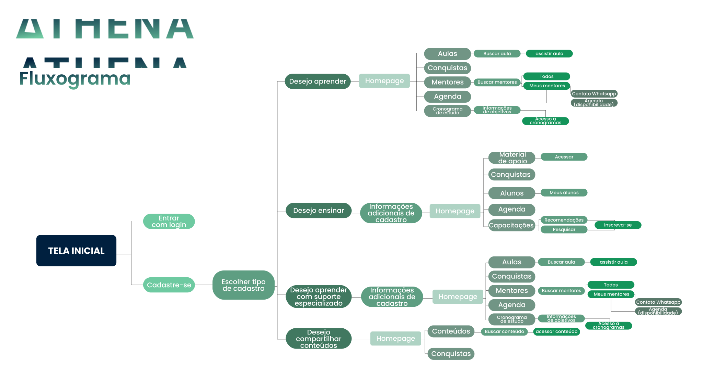

# Athena

## 📖 Introdução 

A Athena é uma plataforma web inovadora que possui uma gama de materiais e mentores de tecnologia. Com o objetivo de proporcionar suporte e aprendizado a pessoas com deficiência cognitivas ou neurodivergências, bem como a qualquer pessoa interessada em adquirir conhecimentos tecnológicos. 

Além disso, também ter materiais de aprendizado em tecnologia disponíveis para aqueles que queiram usar e compartilhar com outras pessoas.

## 🔗Link de Acesso
- Deploy Vercel: [clique aqui!](https://athena-jet.vercel.app/)
- Layout Figma: [clique aqui!](https://www.figma.com/file/0qSn6LRizzOON0A4fd65qh/HACKA?type=design&node-id=41-40&t=4SemDPvhUNNLc40W-0)


## 👥Equipe
| [<br><sub>Daniel Emidio<br>Tecnologia</sub>](https://www.linkedin.com/in/danielemidio1988/) |[<br><sub>Luis Vinicius<br>Tecnologia e Negócios</sub>](https://www.linkedin.com/in/luislauriano) |[<br><sub>Emmanuel Leon<br>Negócios e Inovação</sub>](https://www.linkedin.com/in/leonhc/) |[<br><sub>Gabriella Graciano<br>UX Design</sub>](https://www.linkedin.com/in/gabygraciano/) |[<br><sub>Felipe Ribeiro<br>Negócios e Inovação</sub>](https://www.linkedin.com/in/fgribeiro/) |
| :---: |:---: |:---: |:---: |:---: |

## 🧭Status do Projeto
- ⏳Concluído

## 📄Concepção do Projeto

## Fluxograma do Projeto
| <br><sub>Fluxograma</sub> | 
| :---: |

### Instalando
- Abra o terminal GitBash e clone o link deste repositório;
- Ainda dentro do terminal, insira o comando abaixo:

```bash
# Instalando dependências
npm install

# executando o projeto no navegador
npm start
```

### Bibliotecas Utilizadas

```bash
react-router-dom
styled-components
```

## 💡Programas utilizados:
- VSCode

## 💻Tecnologias 


